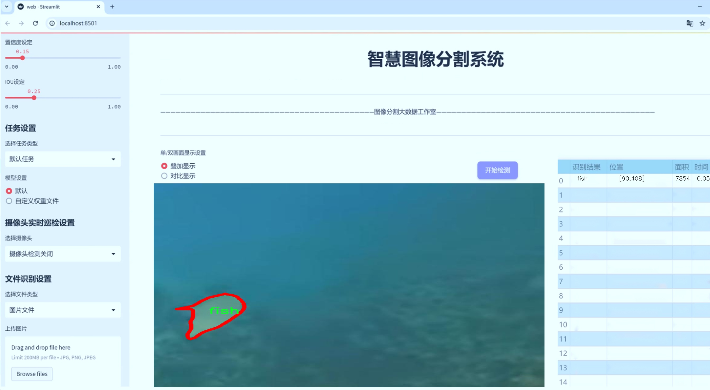
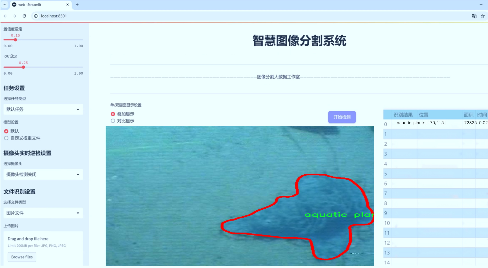
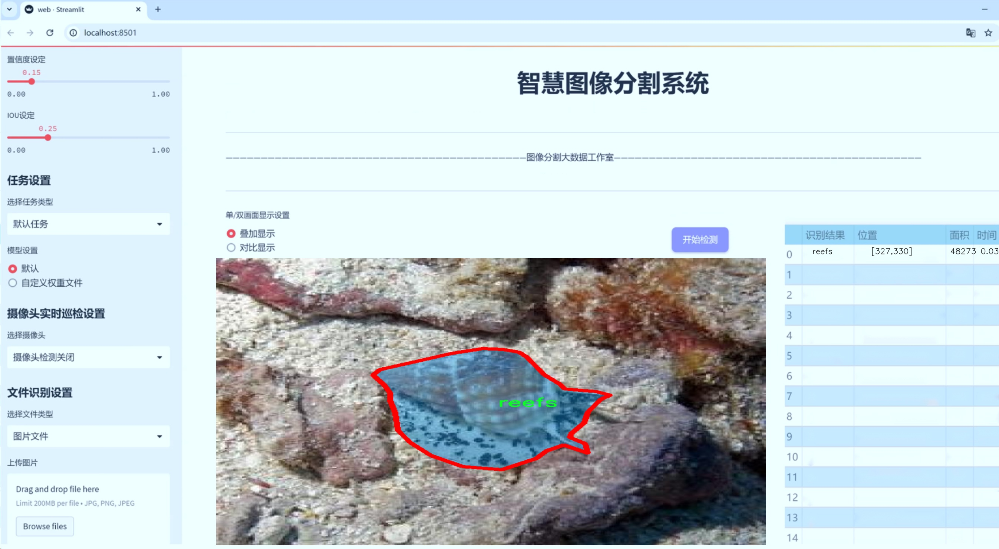
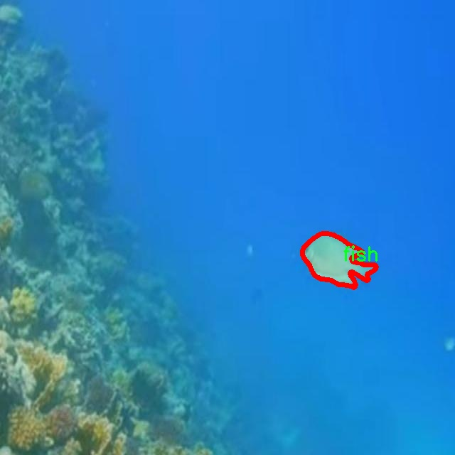
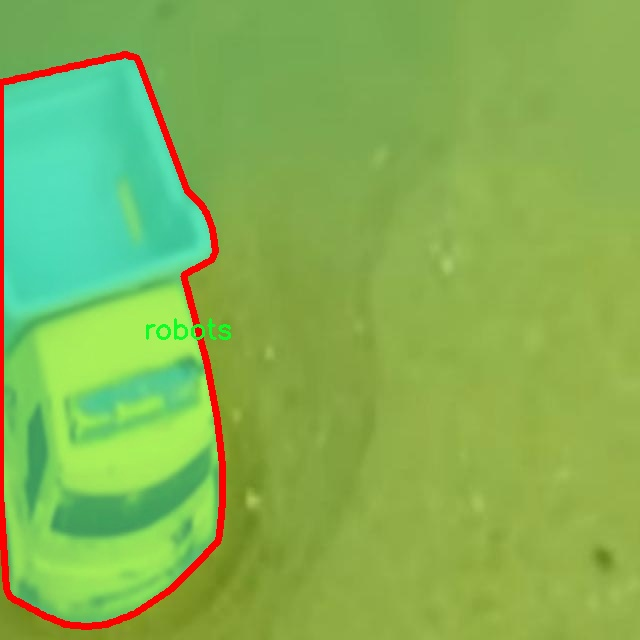
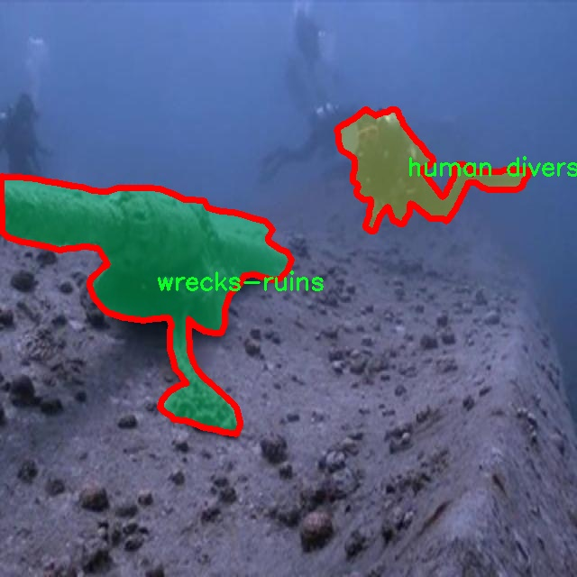
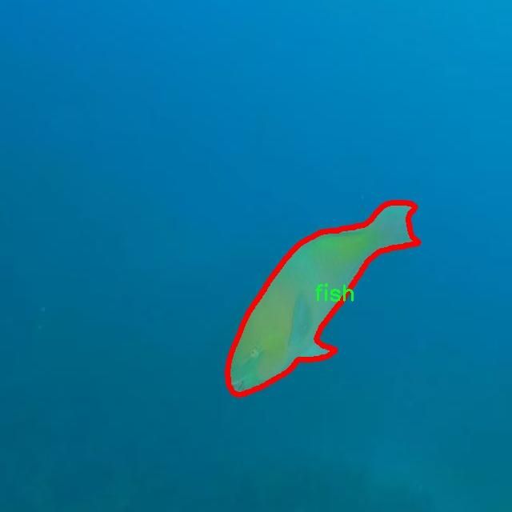
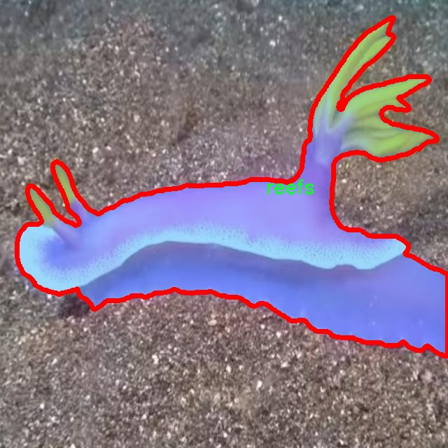

# 水下生物场景物品图像分割系统： yolov8-seg-FocalModulation

### 1.研究背景与意义

[参考博客](https://gitee.com/YOLOv8_YOLOv11_Segmentation_Studio/projects)

[博客来源](https://kdocs.cn/l/cszuIiCKVNis)

研究背景与意义

随着全球水域生态环境的日益恶化，水下生物的保护与监测已成为生态学、环境科学及生物多样性研究中的重要课题。水下生物的多样性和复杂性使得传统的监测手段面临诸多挑战，尤其是在图像识别和物体分割方面。近年来，深度学习技术的迅猛发展为水下生物图像处理提供了新的解决方案，其中基于YOLO（You Only Look Once）系列模型的实例分割技术因其高效性和准确性而受到广泛关注。YOLOv8作为该系列的最新版本，具备了更强的特征提取能力和实时处理能力，适合在复杂的水下环境中进行生物物种的自动识别与分割。

本研究旨在基于改进的YOLOv8模型，构建一个高效的水下生物场景物品图像分割系统。该系统将利用一个包含4600幅图像的专用数据集，涵盖了七个主要类别：水生植物、鱼类、潜水员、珊瑚礁、机器人、海底及沉船遗迹。这些类别不仅代表了水下生态系统的多样性，还涉及到人类活动对水下环境的影响。通过对这些类别的精确分割与识别，研究者能够更好地理解水下生态系统的结构与功能，进而为保护和恢复水下生物多样性提供科学依据。

在水下环境中，光线的折射、反射及散射等因素使得图像质量受到影响，传统的图像处理技术难以适应这种复杂的背景。YOLOv8模型的引入，结合针对水下图像特征的改进，能够有效提升分割精度和速度。此外，针对数据集中的不同类别，研究将采用多种数据增强技术，以提高模型的泛化能力和鲁棒性。这一过程不仅能够提升模型在实际应用中的表现，还能为后续的水下生物监测提供更为可靠的技术支持。

本研究的意义在于，通过构建基于YOLOv8的水下生物场景物品图像分割系统，推动水下生态监测技术的发展，提升对水下生物多样性的保护能力。该系统不仅可以应用于科学研究，还可为海洋保护区的管理、渔业资源的监测以及水下考古等领域提供支持。通过实现对水下生物的自动化识别与分割，研究者能够更高效地收集和分析数据，从而在政策制定和环境保护方面做出更为科学的决策。

综上所述，本研究不仅具有重要的学术价值，也具有广泛的应用前景。通过改进YOLOv8模型，结合丰富的水下生物数据集，能够为水下生态系统的监测与保护提供强有力的技术支持，助力实现可持续发展目标。

### 2.图片演示







注意：本项目提供完整的训练源码数据集和训练教程,由于此博客编辑较早,暂不提供权重文件（best.pt）,需要按照6.训练教程进行训练后实现上图效果。

### 3.视频演示

[3.1 视频演示](https://www.bilibili.com/video/BV1odmoYmEDZ/)

### 4.数据集信息

##### 4.1 数据集类别数＆类别名

nc: 7
names: ['aquatic plants', 'fish', 'human divers', 'reefs', 'robots', 'sea-floor', 'wrecks-ruins']


##### 4.2 数据集信息简介

数据集信息展示

在水下生物场景物品图像分割的研究中，"UnderWater instance segmentation" 数据集扮演着至关重要的角色。该数据集专为改进YOLOv8-seg模型而设计，旨在提升水下环境中物体识别和分割的准确性与效率。随着水下探测技术的不断进步，准确识别和分割水下生物及其栖息环境变得愈发重要，这不仅对生态研究有着深远的影响，也为海洋资源的可持续利用提供了数据支持。

该数据集包含七个主要类别，涵盖了水下生态系统的多样性。这七个类别分别是：水生植物、鱼类、人类潜水员、珊瑚礁、机器人、海底和沉船遗迹。每个类别都代表了水下环境中不同的生物或物体，具有独特的特征和形态。水生植物作为水下生态系统的基础，提供了栖息地和食物来源；鱼类则是水下生物链的重要组成部分，具有丰富的种类和形态变化；人类潜水员的存在则体现了人类对海洋的探索与研究；珊瑚礁不仅是生物多样性的热点，也是海洋生态健康的指示器；机器人在水下探测和研究中发挥着越来越重要的作用；海底则是一个充满神秘的领域，蕴藏着丰富的自然资源；而沉船遗迹则承载着历史的记忆，成为水下考古的重要对象。

为了实现高效的图像分割，数据集中的每个类别都经过精心标注，确保在训练过程中能够提供准确的实例信息。这些标注不仅包括物体的边界框，还涵盖了每个物体的具体形状和位置，确保模型能够学习到不同物体的特征。通过使用该数据集，YOLOv8-seg模型能够在复杂的水下环境中有效地识别和分割不同类别的物体，从而提高了图像分割的精度和鲁棒性。

此外，"UnderWater instance segmentation" 数据集的构建考虑到了水下环境的特殊性，包括光线变化、浑浊度、背景复杂性等因素。这些因素使得水下图像分割面临着更大的挑战，因此数据集的多样性和丰富性尤为重要。通过提供多种不同场景和条件下的图像，该数据集为模型的训练提供了坚实的基础，使其能够适应各种实际应用场景。

在实际应用中，改进后的YOLOv8-seg模型将能够在水下探测、生态监测、考古研究等领域发挥重要作用。无论是对水下生物的监测，还是对沉船遗迹的保护，准确的图像分割都将为科学研究和资源管理提供重要的数据支持。随着技术的不断进步，"UnderWater instance segmentation" 数据集将继续为水下图像分割领域的发展提供源源不断的动力，推动相关研究的深入与拓展。











### 5.项目依赖环境部署教程（零基础手把手教学）

[5.1 环境部署教程链接（零基础手把手教学）](https://www.bilibili.com/video/BV1jG4Ve4E9t/?vd_source=bc9aec86d164b67a7004b996143742dc)


[5.2 安装Python虚拟环境创建和依赖库安装视频教程链接（零基础手把手教学）](https://www.bilibili.com/video/BV1nA4VeYEze/?vd_source=bc9aec86d164b67a7004b996143742dc)

### 6.手把手YOLOV8-seg训练视频教程（零基础手把手教学）

[6.1 手把手YOLOV8-seg训练视频教程（零基础小白有手就能学会）](https://www.bilibili.com/video/BV1cA4VeYETe/?vd_source=bc9aec86d164b67a7004b996143742dc)


按照上面的训练视频教程链接加载项目提供的数据集，运行train.py即可开始训练



     Epoch   gpu_mem       box       obj       cls    labels  img_size
     1/200     0G   0.01576   0.01955  0.007536        22      1280: 100%|██████████| 849/849 [14:42<00:00,  1.04s/it]
               Class     Images     Labels          P          R     mAP@.5 mAP@.5:.95: 100%|██████████| 213/213 [01:14<00:00,  2.87it/s]
                 all       3395      17314      0.994      0.957      0.0957      0.0843

     Epoch   gpu_mem       box       obj       cls    labels  img_size
     2/200     0G   0.01578   0.01923  0.007006        22      1280: 100%|██████████| 849/849 [14:44<00:00,  1.04s/it]
               Class     Images     Labels          P          R     mAP@.5 mAP@.5:.95: 100%|██████████| 213/213 [01:12<00:00,  2.95it/s]
                 all       3395      17314      0.996      0.956      0.0957      0.0845

     Epoch   gpu_mem       box       obj       cls    labels  img_size
     3/200     0G   0.01561    0.0191  0.006895        27      1280: 100%|██████████| 849/849 [10:56<00:00,  1.29it/s]
               Class     Images     Labels          P          R     mAP@.5 mAP@.5:.95: 100%|███████   | 187/213 [00:52<00:00,  4.04it/s]
                 all       3395      17314      0.996      0.957      0.0957      0.0845


### 7.50+种全套YOLOV8-seg创新点加载调参实验视频教程（一键加载写好的改进模型的配置文件）

[7.1 50+种全套YOLOV8-seg创新点加载调参实验视频教程（一键加载写好的改进模型的配置文件）](https://www.bilibili.com/video/BV1Hw4VePEXv/?vd_source=bc9aec86d164b67a7004b996143742dc)

### YOLOV8-seg算法简介

原始YOLOV8-seg算法原理

YOLOv8-seg算法是YOLO系列目标检测模型的最新版本，结合了目标检测与图像分割的功能，展现出卓越的性能和灵活性。该算法在设计上旨在满足现代计算机视觉任务的需求，尤其是在复杂场景下的目标识别和分割。YOLOv8-seg的核心原理可以分为三个主要部分：Backbone、Neck和Head，每个部分在整体架构中扮演着至关重要的角色。

在Backbone部分，YOLOv8-seg采用了CSPDarknet结构，这是一个经过优化的特征提取网络。CSPDarknet的设计理念是通过交叉阶段部分（Cross Stage Partial）的方法来增强梯度流，减少模型的计算复杂度。与之前的YOLO版本相比，YOLOv8-seg引入了C2f模块，替代了传统的C3模块。C2f模块的独特之处在于它将输入特征图分为两个分支，分别经过卷积层进行降维处理，并在此基础上进一步引入了v8_C2fBottleneck层。每个Bottleneck层的输出都被视为一个独立的分支，最终通过卷积层进行融合，形成高维特征图。这种设计不仅提高了特征提取的效率，还增强了模型对复杂特征的捕捉能力。

Neck部分则采用了特征金字塔网络（FPN）与路径聚合网络（PAN）的结合，旨在处理不同尺度的特征信息。YOLOv8-seg在这一部分的创新在于引入了快速空间金字塔池化（SPPF）结构，使得模型能够有效提取多尺度特征，同时减少参数量和计算量。这种特征融合方式使得YOLOv8-seg在处理不同大小的目标时表现得更加灵活和高效。

在Head部分，YOLOv8-seg进行了重大改进，特别是在检测和分割任务的解耦上。与之前的Coupled-Head结构不同，YOLOv8-seg采用了Decoupled-Head结构，分别为目标检测和图像分割任务设计了独立的卷积模块。这种解耦设计使得模型在处理不同任务时能够更加专注，从而提高了整体的预测精度。此外，YOLOv8-seg抛弃了传统的Anchor-Based方法，转而采用Anchor-Free的检测方式。这一转变使得模型在训练过程中不再依赖于预设的锚框，而是直接预测目标的中心点和宽高比例。这种方法不仅简化了模型的结构，还提升了检测速度和准确度。

YOLOv8-seg在输入处理上也进行了创新，采用自适应图片缩放技术，以提高目标检测和推理的速度。在训练阶段，YOLOv8-seg引入了Mosaic图像增强操作，通过将多张图像随机拼接成一张新的训练样本，迫使模型学习不同位置和周围像素的特征。这种数据增强策略有效提高了模型的泛化能力，使其在面对多样化的输入时依然能够保持高效的检测性能。

在损失函数的设计上，YOLOv8-seg针对目标检测和分割任务的特点进行了优化。分类分支中使用了二值交叉熵损失（BCELoss），而边界框回归分支则采用了分布焦点损失（DFL）和CIoU损失的组合。这种损失函数的设计使得模型能够更快地聚焦于标签附近的区域，提高了预测的准确性。

总的来说，YOLOv8-seg算法通过一系列创新的设计和优化，不仅提升了目标检测的准确性和速度，还增强了对图像分割任务的支持。其高效的特征提取、灵活的结构设计以及强大的数据增强能力，使得YOLOv8-seg成为现代计算机视觉领域中一款极具竞争力的模型。随着YOLOv8-seg的不断发展和应用，其在各类实际场景中的表现将更加出色，为智能视觉系统的构建提供强有力的支持。


### 9.系统功能展示（检测对象为举例，实际内容以本项目数据集为准）

图9.1.系统支持检测结果表格显示

  图9.2.系统支持置信度和IOU阈值手动调节

  图9.3.系统支持自定义加载权重文件best.pt(需要你通过步骤5中训练获得)

  图9.4.系统支持摄像头实时识别

  图9.5.系统支持图片识别

  图9.6.系统支持视频识别

  图9.7.系统支持识别结果文件自动保存

  图9.8.系统支持Excel导出检测结果数据


### 10.50+种全套YOLOV8-seg创新点原理讲解（非科班也可以轻松写刊发刊，V11版本正在科研待更新）

#### 10.1 由于篇幅限制，每个创新点的具体原理讲解就不一一展开，具体见下列网址中的创新点对应子项目的技术原理博客网址【Blog】：


[10.1 50+种全套YOLOV8-seg创新点原理讲解链接](https://gitee.com/qunmasj/good)

#### 10.2 部分改进模块原理讲解(完整的改进原理见上图和技术博客链接)【如果此小节的图加载失败可以通过CSDN或者Github搜索该博客的标题访问原始博客，原始博客图片显示正常】

### Gold-YOLO


#### Preliminaries
YOLO系列的中间层结构采用了传统的FPN结构，其中包含多个分支用于多尺度特征融合。然而，它只充分融合来自相邻级别的特征，对于其他层次的信息只能间接地进行“递归”获取。

传统的FPN结构在信息传输过程中存在丢失大量信息的问题。这是因为层之间的信息交互仅限于中间层选择的信息，未被选择的信息在传输过程中被丢弃。这种情况导致某个Level的信息只能充分辅助相邻层，而对其他全局层的帮助较弱。因此，整体上信息融合的有效性可能受到限制。
为了避免在传输过程中丢失信息，本文采用了一种新颖的“聚集和分发”机制（GD），放弃了原始的递归方法。该机制使用一个统一的模块来收集和融合所有Level的信息，并将其分发到不同的Level。通过这种方式，作者不仅避免了传统FPN结构固有的信息丢失问题，还增强了中间层的部分信息融合能力，而且并没有显著增加延迟。


#### 低阶聚合和分发分支 Low-stage gather-and-distribute branch
从主干网络中选择输出的B2、B3、B4、B5特征进行融合，以获取保留小目标信息的高分辨率特征。


#### 高阶聚合和分发分支 High-stage gather-and-distribute branch
高级全局特征对齐模块（High-GD）将由低级全局特征对齐模块（Low-GD）生成的特征{P3, P4, P5}进行融合。


Transformer融合模块由多个堆叠的transformer组成，transformer块的数量为L。每个transformer块包括一个多头注意力块、一个前馈网络（FFN）和残差连接。采用与LeViT相同的设置来配置多头注意力块，使用16个通道作为键K和查询Q的头维度，32个通道作为值V的头维度。为了加速推理过程，将层归一化操作替换为批归一化，并将所有的GELU激活函数替换为ReLU。为了增强变换器块的局部连接，在两个1x1卷积层之间添加了一个深度卷积层。同时，将FFN的扩展因子设置为2，以在速度和计算成本之间取得平衡。


信息注入模块(Information injection module)： 高级全局特征对齐模块（High-GD）中的信息注入模块与低级全局特征对齐模块（Low-GD）中的相同。在高级阶段，局部特征（Flocal）等于Pi，因此公式如下所示：


#### 增强的跨层信息流动 Enhanced cross-layer information flow
为了进一步提升性能，从YOLOv6 中的PAFPN模块中得到启发，引入了Inject-LAF模块。该模块是注入模块的增强版，包括了一个轻量级相邻层融合（LAF）模块，该模块被添加到注入模块的输入位置。为了在速度和准确性之间取得平衡，设计了两个LAF模型：LAF低级模型和LAF高级模型，分别用于低级注入（合并相邻两层的特征）和高级注入（合并相邻一层的特征）。它们的结构如图5(b)所示。为了确保来自不同层级的特征图与目标大小对齐，在实现中的两个LAF模型仅使用了三个操作符：双线性插值（上采样过小的特征）、平均池化（下采样过大的特征）和1x1卷积（调整与目标通道不同的特征）。模型中的LAF模块与信息注入模块的结合有效地平衡了准确性和速度之间的关系。通过使用简化的操作，能够增加不同层级之间的信息流路径数量，从而提高性能而不显著增加延迟。


### 11.项目核心源码讲解（再也不用担心看不懂代码逻辑）

#### 11.1 ultralytics\utils\patches.py

以下是对给定代码的核心部分进行提取和详细注释的结果：

```python
# Ultralytics YOLO 🚀, AGPL-3.0 license
"""对现有函数的功能进行更新和扩展的猴子补丁。"""

from pathlib import Path
import cv2
import numpy as np
import torch

# OpenCV多语言友好的函数 ------------------------------------------------------------------------------

def imread(filename: str, flags: int = cv2.IMREAD_COLOR):
    """
    从文件中读取图像。

    参数:
        filename (str): 要读取的文件路径。
        flags (int, optional): 标志，可以取cv2.IMREAD_*的值。默认为cv2.IMREAD_COLOR。

    返回:
        (np.ndarray): 读取的图像。
    """
    # 使用cv2.imdecode从文件中读取图像，并将其解码为numpy数组
    return cv2.imdecode(np.fromfile(filename, np.uint8), flags)


def imwrite(filename: str, img: np.ndarray, params=None):
    """
    将图像写入文件。

    参数:
        filename (str): 要写入的文件路径。
        img (np.ndarray): 要写入的图像。
        params (list of ints, optional): 额外参数。请参阅OpenCV文档。

    返回:
        (bool): 如果文件写入成功，则返回True，否则返回False。
    """
    try:
        # 使用cv2.imencode将图像编码并写入文件
        cv2.imencode(Path(filename).suffix, img, params)[1].tofile(filename)
        return True
    except Exception:
        return False


def imshow(winname: str, mat: np.ndarray):
    """
    在指定窗口中显示图像。

    参数:
        winname (str): 窗口的名称。
        mat (np.ndarray): 要显示的图像。
    """
    # 使用cv2.imshow显示图像，窗口名称进行编码以避免Unicode错误
    cv2.imshow(winname.encode('unicode_escape').decode(), mat)


# PyTorch函数 ----------------------------------------------------------------------------------------------------

def torch_save(*args, **kwargs):
    """
    使用dill（如果存在）序列化lambda函数，pickle无法处理的情况。

    参数:
        *args (tuple): 传递给torch.save的位置参数。
        **kwargs (dict): 传递给torch.save的关键字参数。
    """
    try:
        import dill as pickle  # 尝试导入dill模块
    except ImportError:
        import pickle  # 如果dill不可用，则使用pickle

    # 如果kwargs中没有'pickle_module'，则将其设置为pickle
    if 'pickle_module' not in kwargs:
        kwargs['pickle_module'] = pickle
    return torch.save(*args, **kwargs)  # 调用torch.save进行保存
```

### 代码分析：
1. **imread**: 该函数用于从指定路径读取图像，并返回为NumPy数组。使用`cv2.imdecode`可以处理不同编码格式的图像。
2. **imwrite**: 将NumPy数组格式的图像写入指定文件。通过`cv2.imencode`将图像编码为指定格式并写入文件，支持多种图像格式。
3. **imshow**: 在窗口中显示图像，处理了窗口名称的编码问题，以确保在不同语言环境下的兼容性。
4. **torch_save**: 该函数用于保存PyTorch模型，支持使用`dill`模块序列化lambda函数，以解决`pickle`无法处理的情况。

这个文件 `ultralytics/utils/patches.py` 是一个用于扩展和更新现有功能的猴子补丁（monkey patches）文件，主要涉及图像处理和模型保存的功能。文件中使用了 OpenCV 和 PyTorch 库，以下是对代码的逐行讲解。

首先，文件导入了必要的库，包括 `Path`（用于处理文件路径）、`cv2`（OpenCV库，用于图像处理）、`numpy`（用于数组操作）和 `torch`（PyTorch库，用于深度学习）。

接下来，定义了一个 `_imshow` 变量，它是 `cv2.imshow` 的一个副本，目的是为了避免递归错误。接下来的几个函数都是对 OpenCV 和 PyTorch 的功能进行封装和扩展。

`imread` 函数用于从文件中读取图像。它接受两个参数：`filename` 是要读取的文件路径，`flags` 是读取图像的标志，默认为 `cv2.IMREAD_COLOR`。函数内部使用 `cv2.imdecode` 和 `np.fromfile` 结合读取图像文件，返回读取到的图像数组。

`imwrite` 函数用于将图像写入文件。它接受三个参数：`filename` 是要写入的文件路径，`img` 是要写入的图像数组，`params` 是可选的额外参数。函数尝试使用 `cv2.imencode` 将图像编码并写入文件，如果成功则返回 `True`，否则返回 `False`。

`imshow` 函数用于在指定窗口中显示图像。它接受两个参数：`winname` 是窗口的名称，`mat` 是要显示的图像数组。这里调用了之前定义的 `_imshow`，并对窗口名称进行了编码处理，以确保支持多语言。

接下来是与 PyTorch 相关的部分。首先定义了一个 `_torch_save` 变量，它是 `torch.save` 的副本，同样是为了避免递归错误。`torch_save` 函数用于保存模型，特别是处理一些特殊情况，比如序列化 lambda 函数。它接受任意数量的位置参数和关键字参数。如果没有指定 `pickle_module`，则使用 `dill`（如果可用）或 `pickle` 作为序列化模块。最后调用 `_torch_save` 来执行实际的保存操作。

总体来说，这个文件通过封装和扩展 OpenCV 和 PyTorch 的一些功能，提供了更灵活和多语言友好的图像处理和模型保存的接口。

#### 11.2 train.py

以下是代码中最核心的部分，并附上详细的中文注释：

```python
import os
import torch
import yaml
from ultralytics import YOLO  # 导入YOLO模型库

if __name__ == '__main__':  # 确保该模块被直接运行时才执行以下代码
    # 设置训练参数
    workers = 1  # 数据加载时使用的工作进程数量
    batch = 8  # 每个批次的样本数量，需根据显存大小调整
    device = "0" if torch.cuda.is_available() else "cpu"  # 检查是否有可用的GPU，若无则使用CPU

    # 获取数据集配置文件的绝对路径
    data_path = abs_path(f'datasets/data/data.yaml', path_type='current')

    # 将路径格式转换为Unix风格
    unix_style_path = data_path.replace(os.sep, '/')
    # 获取数据集目录路径
    directory_path = os.path.dirname(unix_style_path)

    # 读取YAML配置文件
    with open(data_path, 'r') as file:
        data = yaml.load(file, Loader=yaml.FullLoader)

    # 修改数据集路径
    if 'train' in data and 'val' in data and 'test' in data:
        data['train'] = directory_path + '/train'  # 设置训练集路径
        data['val'] = directory_path + '/val'      # 设置验证集路径
        data['test'] = directory_path + '/test'    # 设置测试集路径

        # 将修改后的数据写回YAML文件
        with open(data_path, 'w') as file:
            yaml.safe_dump(data, file, sort_keys=False)

    # 加载YOLO模型配置和预训练权重
    model = YOLO(r"C:\codeseg\codenew\50+种YOLOv8算法改进源码大全和调试加载训练教程（非必要）\改进YOLOv8模型配置文件\yolov8-seg-C2f-Faster.yaml").load("./weights/yolov8s-seg.pt")

    # 开始训练模型
    results = model.train(
        data=data_path,  # 指定训练数据的配置文件路径
        device=device,  # 指定训练设备（GPU或CPU）
        workers=workers,  # 指定数据加载的工作进程数量
        imgsz=640,  # 输入图像的大小为640x640
        epochs=100,  # 训练100个epoch
        batch=batch,  # 每个批次的样本数量
    )
```

### 代码核心部分说明：
1. **导入必要的库**：导入了处理文件路径、深度学习框架（PyTorch）、YAML文件处理和YOLO模型的相关库。
2. **参数设置**：定义了数据加载的工作进程数量、批次大小和设备选择（GPU或CPU）。
3. **数据集路径处理**：读取YAML配置文件，修改其中的训练、验证和测试集路径，以确保路径正确。
4. **模型加载**：加载YOLO模型的配置文件和预训练权重。
5. **模型训练**：调用模型的训练方法，传入数据路径、设备、工作进程数量、图像大小、训练轮数和批次大小等参数。

这个程序文件 `train.py` 是用于训练 YOLO（You Only Look Once）模型的脚本，主要功能是加载数据集、配置模型并开始训练。以下是对代码的逐行解释。

首先，程序导入了一些必要的库，包括 `os`、`torch`、`yaml` 和 `ultralytics` 中的 YOLO 模型。这些库分别用于文件操作、深度学习框架、YAML 文件解析和 YOLO 模型的使用。

在 `if __name__ == '__main__':` 语句下，程序确保只有在直接运行该脚本时才会执行以下代码。接下来，设置了一些训练参数，如 `workers`（数据加载的工作进程数）、`batch`（每个批次的样本数）和 `device`（用于训练的设备，优先使用 GPU）。

程序通过 `abs_path` 函数获取数据集配置文件 `data.yaml` 的绝对路径，并将路径中的分隔符统一为 UNIX 风格的斜杠。然后，利用 `os.path.dirname` 获取数据集目录的路径。

接着，程序打开 `data.yaml` 文件并读取其内容。通过 `yaml.load` 函数将 YAML 文件解析为 Python 字典。接下来，程序检查字典中是否包含 `train`、`val` 和 `test` 这三个键，如果存在，则更新它们的路径为相对于数据集目录的路径。修改完成后，程序将更新后的字典写回到原 YAML 文件中，确保路径的正确性。

在模型部分，程序加载了一个 YOLO 模型的配置文件，并通过 `load` 方法加载预训练的权重文件。这里的路径是硬编码的，用户需要根据自己的文件结构进行调整。

最后，程序调用 `model.train` 方法开始训练模型，传入的数据包括训练数据的配置文件路径、设备、工作进程数、输入图像大小、训练的 epoch 数量和批次大小等参数。训练将会在指定的设备上进行，使用设置的参数进行迭代。

总的来说，这个脚本的目的是为 YOLO 模型的训练过程提供一个完整的流程，从数据准备到模型训练的配置都进行了详细的设置。

#### 11.3 ultralytics\nn\tasks.py

以下是代码中最核心的部分，并附上详细的中文注释：

```python
import torch
import torch.nn as nn

class BaseModel(nn.Module):
    """BaseModel类是Ultralytics YOLO系列模型的基类。"""

    def forward(self, x, *args, **kwargs):
        """
        模型的前向传播方法，处理单个尺度的输入。

        参数:
            x (torch.Tensor | dict): 输入图像张量或包含图像张量和真实标签的字典。

        返回:
            (torch.Tensor): 网络的输出。
        """
        if isinstance(x, dict):  # 处理训练和验证时的情况
            return self.loss(x, *args, **kwargs)  # 计算损失
        return self.predict(x, *args, **kwargs)  # 进行预测

    def predict(self, x, profile=False, visualize=False, augment=False):
        """
        通过网络进行前向传播。

        参数:
            x (torch.Tensor): 输入张量。
            profile (bool): 如果为True，打印每层的计算时间，默认为False。
            visualize (bool): 如果为True，保存模型的特征图，默认为False。
            augment (bool): 在预测时是否进行图像增强，默认为False。

        返回:
            (torch.Tensor): 模型的最后输出。
        """
        if augment:
            return self._predict_augment(x)  # 进行增强预测
        return self._predict_once(x, profile, visualize)  # 进行一次预测

    def _predict_once(self, x, profile=False, visualize=False):
        """
        执行一次前向传播。

        参数:
            x (torch.Tensor): 输入张量。
            profile (bool): 如果为True，打印每层的计算时间，默认为False。
            visualize (bool): 如果为True，保存模型的特征图，默认为False。

        返回:
            (torch.Tensor): 模型的最后输出。
        """
        y, dt = [], []  # 输出列表和时间记录
        for m in self.model:  # 遍历模型中的每一层
            if m.f != -1:  # 如果不是来自前一层
                x = y[m.f] if isinstance(m.f, int) else [x if j == -1 else y[j] for j in m.f]  # 从早期层获取输入
            if profile:
                self._profile_one_layer(m, x, dt)  # 记录当前层的性能
            x = m(x)  # 执行当前层的前向传播
            y.append(x if m.i in self.save else None)  # 保存输出
            if visualize:
                feature_visualization(x, m.type, m.i, save_dir=visualize)  # 可视化特征图
        return x  # 返回最后的输出

    def loss(self, batch, preds=None):
        """
        计算损失。

        参数:
            batch (dict): 用于计算损失的批次数据。
            preds (torch.Tensor | List[torch.Tensor]): 预测结果。

        返回:
            (torch.Tensor): 计算得到的损失值。
        """
        if not hasattr(self, 'criterion'):
            self.criterion = self.init_criterion()  # 初始化损失函数

        preds = self.forward(batch['img']) if preds is None else preds  # 获取预测结果
        return self.criterion(preds, batch)  # 计算损失

    def init_criterion(self):
        """初始化BaseModel的损失标准。"""
        raise NotImplementedError('compute_loss() needs to be implemented by task heads')  # 抛出未实现异常


class DetectionModel(BaseModel):
    """YOLOv8检测模型。"""

    def __init__(self, cfg='yolov8n.yaml', ch=3, nc=None, verbose=True):
        """初始化YOLOv8检测模型，使用给定的配置和参数。"""
        super().__init__()  # 调用父类构造函数
        self.yaml = cfg if isinstance(cfg, dict) else yaml_model_load(cfg)  # 加载配置

        # 定义模型
        ch = self.yaml['ch'] = self.yaml.get('ch', ch)  # 输入通道
        if nc and nc != self.yaml['nc']:
            self.yaml['nc'] = nc  # 覆盖YAML中的类别数
        self.model, self.save = parse_model(deepcopy(self.yaml), ch=ch, verbose=verbose)  # 解析模型
        self.names = {i: f'{i}' for i in range(self.yaml['nc'])}  # 默认名称字典

        # 初始化权重和偏置
        initialize_weights(self)

    def init_criterion(self):
        """初始化DetectionModel的损失标准。"""
        return v8DetectionLoss(self)  # 返回YOLOv8检测损失实例
```

### 代码核心部分说明：
1. **BaseModel类**：这是所有YOLO模型的基类，包含了前向传播、损失计算等基本功能。
2. **forward方法**：根据输入类型（图像或字典）决定是进行预测还是计算损失。
3. **predict方法**：执行模型的前向传播，可以选择是否进行数据增强和可视化。
4. **loss方法**：计算模型的损失，调用损失标准的初始化方法。
5. **DetectionModel类**：YOLOv8检测模型的实现，继承自BaseModel，负责模型的初始化和损失计算。

以上代码展示了YOLO模型的基本结构和核心功能，便于理解模型的工作原理。

这个程序文件 `ultralytics/nn/tasks.py` 是一个实现了多种深度学习模型的模块，主要用于处理计算机视觉任务，如目标检测、图像分割、姿态估计和图像分类。文件中包含了多个类和函数，以下是对其主要内容的说明。

首先，文件导入了一些必要的库和模块，包括 PyTorch 和其他相关的工具函数。然后定义了一个基类 `BaseModel`，它继承自 `nn.Module`，为所有模型提供了基本的结构和功能。该类实现了前向传播方法 `forward`，根据输入的类型（图像或字典）选择调用损失计算或预测方法。

在 `BaseModel` 中，`predict` 方法执行模型的前向传播，支持多种选项，如性能分析、可视化和数据增强。`_predict_once` 方法则具体实现了模型的前向传播过程，处理每一层的输出，并根据需要保存特定层的输出。

模型的融合和参数初始化也在 `BaseModel` 中定义。`fuse` 方法将卷积层和批归一化层融合，以提高计算效率，而 `initialize_weights` 方法则用于初始化模型的权重。

接下来，文件定义了多个具体模型类，分别继承自 `BaseModel`，如 `DetectionModel`、`SegmentationModel`、`PoseModel` 和 `ClassificationModel`。每个模型类都有其特定的初始化方法和损失计算方法。例如，`DetectionModel` 负责目标检测任务，`SegmentationModel` 处理图像分割，`PoseModel` 用于姿态估计，而 `ClassificationModel` 则用于图像分类。

在 `DetectionModel` 中，模型的配置通过 YAML 文件加载，并根据配置初始化模型结构。该类还实现了数据增强的预测方法 `_predict_augment`，以及损失计算方法 `init_criterion`，具体使用 `v8DetectionLoss`。

文件中还包含了一个 `Ensemble` 类，用于将多个模型组合在一起进行推理，增强模型的预测能力。

此外，文件还定义了一些实用函数，如 `torch_safe_load` 用于安全加载模型权重，`attempt_load_weights` 和 `attempt_load_one_weight` 用于加载单个或多个模型的权重，`parse_model` 用于解析模型的 YAML 配置文件并构建相应的 PyTorch 模型。

最后，文件中还提供了一些辅助函数，如 `yaml_model_load` 和 `guess_model_task`，用于加载模型配置和推测模型的任务类型。

总体而言，这个文件是 Ultralytics YOLO 系列模型的核心部分，提供了模型的结构定义、前向传播、损失计算以及模型加载等功能，为计算机视觉任务提供了强大的支持。

#### 11.4 web.py

以下是代码中最核心的部分，并附上详细的中文注释：

```python
import cv2
import numpy as np
from PIL import ImageFont, ImageDraw, Image
from hashlib import md5

def calculate_polygon_area(points):
    """
    计算多边形的面积，输入应为一个 Nx2 的numpy数组，表示多边形的顶点坐标
    """
    if len(points) < 3:  # 多边形至少需要3个顶点
        return 0
    return cv2.contourArea(points)

def draw_with_chinese(image, text, position, font_size=20, color=(255, 0, 0)):
    """
    在OpenCV图像上绘制中文文字
    """
    # 将图像从 OpenCV 格式（BGR）转换为 PIL 格式（RGB）
    image_pil = Image.fromarray(cv2.cvtColor(image, cv2.COLOR_BGR2RGB))
    draw = ImageDraw.Draw(image_pil)
    # 使用指定的字体
    font = ImageFont.truetype("simsun.ttc", font_size, encoding="unic")
    draw.text(position, text, font=font, fill=color)
    # 将图像从 PIL 格式（RGB）转换回 OpenCV 格式（BGR）
    return cv2.cvtColor(np.array(image_pil), cv2.COLOR_RGB2BGR)

def generate_color_based_on_name(name):
    """
    使用哈希函数生成稳定的颜色
    """
    hash_object = md5(name.encode())
    hex_color = hash_object.hexdigest()[:6]  # 取前6位16进制数
    r, g, b = int(hex_color[0:2], 16), int(hex_color[2:4], 16), int(hex_color[4:6], 16)
    return (b, g, r)  # OpenCV 使用BGR格式

def draw_detections(image, info, alpha=0.2):
    """
    在图像上绘制检测结果，包括边界框和标签
    """
    name, bbox, conf, cls_id, mask = info['class_name'], info['bbox'], info['score'], info['class_id'], info['mask']
    x1, y1, x2, y2 = bbox
    # 绘制边界框
    cv2.rectangle(image, (x1, y1), (x2, y2), color=(0, 0, 255), thickness=3)
    # 绘制类别名称
    image = draw_with_chinese(image, name, (x1, y1 - 10), font_size=20)
    return image

def frame_process(image, model, conf_threshold=0.15, iou_threshold=0.5):
    """
    处理并预测单个图像帧的内容。

    Args:
        image (numpy.ndarray): 输入的图像。
        model: 预测模型。
        conf_threshold (float): 置信度阈值。
        iou_threshold (float): IOU阈值。

    Returns:
        tuple: 处理后的图像，检测信息。
    """
    pre_img = model.preprocess(image)  # 对图像进行预处理
    params = {'conf': conf_threshold, 'iou': iou_threshold}
    model.set_param(params)  # 更新模型参数

    pred = model.predict(pre_img)  # 使用模型进行预测
    detInfo = []  # 初始化检测信息列表

    if pred is not None and len(pred):
        for info in pred:  # 遍历检测到的对象
            image = draw_detections(image, info)  # 绘制检测结果
            detInfo.append(info)  # 添加检测信息

    return image, detInfo

# 示例：如何使用上述函数
if __name__ == "__main__":
    # 假设有一个加载好的模型和一张输入图像
    model = ...  # 加载模型
    image = cv2.imread('input_image.jpg')  # 读取输入图像

    # 处理图像并获取检测结果
    processed_image, detections = frame_process(image, model)

    # 显示处理后的图像
    cv2.imshow('Detections', processed_image)
    cv2.waitKey(0)
    cv2.destroyAllWindows()
```

### 代码核心部分说明：
1. **calculate_polygon_area**: 计算多边形的面积，确保输入至少有三个顶点。
2. **draw_with_chinese**: 在图像上绘制中文文本，使用PIL库处理中文字体。
3. **generate_color_based_on_name**: 根据名称生成稳定的颜色，使用MD5哈希来确保相同名称生成相同颜色。
4. **draw_detections**: 在图像上绘制检测结果，包括边界框和类别名称。
5. **frame_process**: 处理输入图像，使用模型进行预测，并绘制检测结果。

### 代码使用示例：
在主程序中，加载模型和输入图像，然后调用`frame_process`函数进行处理，并显示处理后的图像。

这个程序文件 `web.py` 是一个基于 Streamlit 的图像分割和目标检测系统，主要用于实时处理摄像头视频流或上传的图像和视频文件。以下是对代码的详细讲解。

程序首先导入了一系列必要的库，包括随机数生成、临时文件处理、时间处理、OpenCV、NumPy、Streamlit、PIL（用于图像处理）、以及一些自定义模块。接着定义了一些辅助函数，比如计算多边形面积、在图像上绘制中文文本、生成基于名称的颜色、调整参数等。

`Detection_UI` 类是程序的核心，负责初始化检测系统的参数和界面。它的构造函数中设置了模型类型、置信度阈值、IOU阈值等参数，并初始化了摄像头和文件相关的变量。通过调用 `setup_page` 和 `setup_sidebar` 方法，设置了页面的标题和侧边栏的内容，包括模型选择、摄像头选择和文件上传选项。

在 `process_camera_or_file` 方法中，程序根据用户选择的输入源（摄像头、图片文件或视频文件）进行处理。如果选择了摄像头，程序会打开摄像头并读取视频流，对每一帧进行处理，绘制检测框和标签，并显示在界面上。如果选择了上传的文件，程序会读取文件并进行相应的处理。

`frame_process` 方法用于处理单个图像帧的内容，调用模型进行预测，并处理预测结果。该方法会对输入图像进行预处理，然后使用模型进行推理，最后绘制检测框和标签，并将结果保存到日志表中。

程序还提供了多种功能，比如实时显示检测结果、保存检测结果到 CSV 文件、更新检测结果表格等。用户可以通过侧边栏选择不同的模型、摄像头和文件类型，并在主界面上查看处理结果。

最后，程序通过实例化 `Detection_UI` 类并调用 `setupMainWindow` 方法来启动应用。整个程序的设计旨在提供一个用户友好的界面，方便用户进行图像分割和目标检测的操作。

#### 11.5 ultralytics\engine\validator.py

以下是代码中最核心的部分，并附上详细的中文注释：

```python
class BaseValidator:
    """
    BaseValidator类用于创建验证器的基类。

    属性:
        args (SimpleNamespace): 验证器的配置。
        dataloader (DataLoader): 用于验证的数据加载器。
        model (nn.Module): 要验证的模型。
        device (torch.device): 用于验证的设备。
        speed (dict): 包含预处理、推理、损失和后处理的速度信息。
        save_dir (Path): 保存结果的目录。
    """

    def __init__(self, dataloader=None, save_dir=None, args=None):
        """
        初始化BaseValidator实例。

        参数:
            dataloader (torch.utils.data.DataLoader): 用于验证的数据加载器。
            save_dir (Path, optional): 保存结果的目录。
            args (SimpleNamespace): 验证器的配置。
        """
        self.args = get_cfg(overrides=args)  # 获取配置
        self.dataloader = dataloader  # 数据加载器
        self.model = None  # 模型初始化为None
        self.device = None  # 设备初始化为None
        self.speed = {'preprocess': 0.0, 'inference': 0.0, 'loss': 0.0, 'postprocess': 0.0}  # 速度字典
        self.save_dir = save_dir or get_save_dir(self.args)  # 保存目录

    @smart_inference_mode()
    def __call__(self, trainer=None, model=None):
        """支持验证预训练模型或正在训练的模型。"""
        self.training = trainer is not None  # 判断是否在训练模式
        if self.training:
            self.device = trainer.device  # 获取训练设备
            model = trainer.model  # 获取训练模型
            model.eval()  # 设置模型为评估模式
        else:
            model = AutoBackend(model or self.args.model, device=select_device(self.args.device, self.args.batch))  # 自动后端加载模型
            self.device = model.device  # 更新设备

        self.dataloader = self.dataloader or self.get_dataloader(self.args.data, self.args.batch)  # 获取数据加载器
        model.eval()  # 设置模型为评估模式

        for batch_i, batch in enumerate(self.dataloader):  # 遍历数据加载器
            # 预处理
            batch = self.preprocess(batch)

            # 推理
            preds = model(batch['img'])  # 获取模型预测结果

            # 更新指标
            self.update_metrics(preds, batch)

        stats = self.get_stats()  # 获取统计信息
        self.print_results()  # 打印结果
        return stats  # 返回统计信息

    def preprocess(self, batch):
        """预处理输入批次。"""
        return batch  # 返回预处理后的批次

    def update_metrics(self, preds, batch):
        """根据预测结果和批次更新指标。"""
        pass  # 具体实现留空

    def get_stats(self):
        """返回模型性能的统计信息。"""
        return {}  # 返回空字典

    def print_results(self):
        """打印模型预测的结果。"""
        pass  # 具体实现留空
```

### 代码核心部分说明：
1. **BaseValidator类**：这是一个基类，用于创建验证器，包含了模型验证所需的基本属性和方法。
2. **__init__方法**：初始化验证器的配置、数据加载器、模型、设备和速度信息。
3. **__call__方法**：这是验证器的主要逻辑，支持验证预训练模型或正在训练的模型。它处理数据加载、模型推理和指标更新。
4. **preprocess方法**：用于预处理输入数据的占位符方法。
5. **update_metrics方法**：用于更新模型性能指标的占位符方法。
6. **get_stats方法**：返回模型性能统计信息的占位符方法。
7. **print_results方法**：打印模型预测结果的占位符方法。

这些方法和属性构成了验证器的基础框架，具体的实现可以在子类中定义。

这个程序文件 `ultralytics/engine/validator.py` 是用于验证模型在数据集测试或验证集上的准确性，主要用于 YOLO（You Only Look Once）系列模型的评估。文件中包含了一个名为 `BaseValidator` 的类，作为验证器的基类，提供了一系列方法和属性来支持模型的验证过程。

在文件开头，提供了使用该验证器的示例命令，用户可以通过命令行指定模型文件、数据集配置文件以及图像大小等参数来进行验证。支持多种模型格式，包括 PyTorch、TorchScript、ONNX、TensorRT 等。

`BaseValidator` 类的构造函数初始化了一些属性，包括配置参数、数据加载器、进度条、模型、设备、当前批次索引等。它还会根据传入的参数设置一些默认值，比如置信度阈值和图像大小。

该类的 `__call__` 方法是验证的核心，支持对预训练模型或正在训练的模型进行验证。它首先检查是否在训练模式，并根据不同的情况选择模型和设备。接着，它会加载数据集，并创建数据加载器。验证过程包括预处理输入数据、进行推理、计算损失、后处理预测结果等步骤，并在每个批次结束时更新统计信息。

在验证过程中，程序会记录处理时间，并在每个批次开始和结束时运行相应的回调函数，以便用户可以在特定事件发生时执行自定义操作。验证完成后，程序会输出统计结果，并根据用户的设置保存结果到指定目录。

此外，`BaseValidator` 类还定义了一些辅助方法，例如 `match_predictions` 用于根据 IoU（Intersection over Union）匹配预测和真实类别，`add_callback` 和 `run_callbacks` 用于管理和执行回调函数，`get_dataloader` 和 `build_dataset` 是抽象方法，需在子类中实现以获取数据加载器和构建数据集。

最后，类中还包含了一些用于处理和更新性能指标的方法，如 `init_metrics`、`update_metrics`、`finalize_metrics` 等，虽然这些方法的具体实现尚未提供，但它们为子类的实现留出了扩展空间。

总的来说，这个文件提供了一个结构化的框架，用于在 YOLO 模型上进行验证，方便用户在不同的数据集和模型格式上进行性能评估。

### 12.系统整体结构（节选）

### 程序整体功能和构架概括

该程序是一个完整的计算机视觉框架，主要用于训练、验证和推理 YOLO（You Only Look Once）系列模型。它包括多个模块，分别负责不同的功能，如模型训练、验证、推理和用户界面。程序的设计旨在提供一个灵活且高效的工具，支持目标检测、图像分割等任务。以下是各个模块的主要功能：

1. **数据处理和模型训练**：`train.py` 负责加载数据集，配置模型参数，并启动训练过程。
2. **模型验证**：`ultralytics/engine/validator.py` 提供了验证模型性能的工具，支持多种模型格式，计算准确性和其他性能指标。
3. **模型结构和任务定义**：`ultralytics/nn/tasks.py` 定义了不同类型的模型结构（如目标检测、图像分割等），并提供了模型的前向传播和损失计算功能。
4. **用户界面**：`web.py` 使用 Streamlit 创建了一个用户友好的界面，允许用户实时处理图像和视频，进行目标检测和图像分割。
5. **功能扩展**：`ultralytics/utils/patches.py` 提供了一些对现有库的扩展和修补，增强了图像处理和模型保存的功能。

### 文件功能整理表

| 文件路径                                | 功能描述                                                                                  |
|-----------------------------------------|-------------------------------------------------------------------------------------------|
| `ultralytics/utils/patches.py`        | 扩展和修补 OpenCV 和 PyTorch 的功能，提供图像读取、写入和模型保存的增强接口。             |
| `train.py`                             | 加载数据集，配置模型参数，并启动 YOLO 模型的训练过程。                                   |
| `ultralytics/nn/tasks.py`             | 定义不同类型的模型结构（如目标检测、图像分割等），实现前向传播和损失计算功能。           |
| `web.py`                               | 创建一个基于 Streamlit 的用户界面，允许用户实时处理摄像头视频流或上传的图像和视频文件。 |
| `ultralytics/engine/validator.py`     | 提供模型验证工具，计算模型在测试集上的准确性和其他性能指标，支持多种模型格式。         |

这个表格总结了每个文件的主要功能，帮助理解整个程序的结构和功能模块。

### 13.图片、视频、摄像头图像分割Demo(去除WebUI)代码

在这个博客小节中，我们将讨论如何在不使用WebUI的情况下，实现图像分割模型的使用。本项目代码已经优化整合，方便用户将分割功能嵌入自己的项目中。
核心功能包括图片、视频、摄像头图像的分割，ROI区域的轮廓提取、类别分类、周长计算、面积计算、圆度计算以及颜色提取等。
这些功能提供了良好的二次开发基础。

### 核心代码解读

以下是主要代码片段，我们会为每一块代码进行详细的批注解释：

```python
import random
import cv2
import numpy as np
from PIL import ImageFont, ImageDraw, Image
from hashlib import md5
from model import Web_Detector
from chinese_name_list import Label_list

# 根据名称生成颜色
def generate_color_based_on_name(name):
    ......

# 计算多边形面积
def calculate_polygon_area(points):
    return cv2.contourArea(points.astype(np.float32))

...
# 绘制中文标签
def draw_with_chinese(image, text, position, font_size=20, color=(255, 0, 0)):
    image_pil = Image.fromarray(cv2.cvtColor(image, cv2.COLOR_BGR2RGB))
    draw = ImageDraw.Draw(image_pil)
    font = ImageFont.truetype("simsun.ttc", font_size, encoding="unic")
    draw.text(position, text, font=font, fill=color)
    return cv2.cvtColor(np.array(image_pil), cv2.COLOR_RGB2BGR)

# 动态调整参数
def adjust_parameter(image_size, base_size=1000):
    max_size = max(image_size)
    return max_size / base_size

# 绘制检测结果
def draw_detections(image, info, alpha=0.2):
    name, bbox, conf, cls_id, mask = info['class_name'], info['bbox'], info['score'], info['class_id'], info['mask']
    adjust_param = adjust_parameter(image.shape[:2])
    spacing = int(20 * adjust_param)

    if mask is None:
        x1, y1, x2, y2 = bbox
        aim_frame_area = (x2 - x1) * (y2 - y1)
        cv2.rectangle(image, (x1, y1), (x2, y2), color=(0, 0, 255), thickness=int(3 * adjust_param))
        image = draw_with_chinese(image, name, (x1, y1 - int(30 * adjust_param)), font_size=int(35 * adjust_param))
        y_offset = int(50 * adjust_param)  # 类别名称上方绘制，其下方留出空间
    else:
        mask_points = np.concatenate(mask)
        aim_frame_area = calculate_polygon_area(mask_points)
        mask_color = generate_color_based_on_name(name)
        try:
            overlay = image.copy()
            cv2.fillPoly(overlay, [mask_points.astype(np.int32)], mask_color)
            image = cv2.addWeighted(overlay, 0.3, image, 0.7, 0)
            cv2.drawContours(image, [mask_points.astype(np.int32)], -1, (0, 0, 255), thickness=int(8 * adjust_param))

            # 计算面积、周长、圆度
            area = cv2.contourArea(mask_points.astype(np.int32))
            perimeter = cv2.arcLength(mask_points.astype(np.int32), True)
            ......

            # 计算色彩
            mask = np.zeros(image.shape[:2], dtype=np.uint8)
            cv2.drawContours(mask, [mask_points.astype(np.int32)], -1, 255, -1)
            color_points = cv2.findNonZero(mask)
            ......

            # 绘制类别名称
            x, y = np.min(mask_points, axis=0).astype(int)
            image = draw_with_chinese(image, name, (x, y - int(30 * adjust_param)), font_size=int(35 * adjust_param))
            y_offset = int(50 * adjust_param)

            # 绘制面积、周长、圆度和色彩值
            metrics = [("Area", area), ("Perimeter", perimeter), ("Circularity", circularity), ("Color", color_str)]
            for idx, (metric_name, metric_value) in enumerate(metrics):
                ......

    return image, aim_frame_area

# 处理每帧图像
def process_frame(model, image):
    pre_img = model.preprocess(image)
    pred = model.predict(pre_img)
    det = pred[0] if det is not None and len(det)
    if det:
        det_info = model.postprocess(pred)
        for info in det_info:
            image, _ = draw_detections(image, info)
    return image

if __name__ == "__main__":
    cls_name = Label_list
    model = Web_Detector()
    model.load_model("./weights/yolov8s-seg.pt")

    # 摄像头实时处理
    cap = cv2.VideoCapture(0)
    while cap.isOpened():
        ret, frame = cap.read()
        if not ret:
            break
        ......

    # 图片处理
    image_path = './icon/OIP.jpg'
    image = cv2.imread(image_path)
    if image is not None:
        processed_image = process_frame(model, image)
        ......

    # 视频处理
    video_path = ''  # 输入视频的路径
    cap = cv2.VideoCapture(video_path)
    while cap.isOpened():
        ret, frame = cap.read()
        ......
```


### 14.完整训练+Web前端界面+50+种创新点源码、数据集获取


# [下载链接：https://mbd.pub/o/bread/Z5aWmJly](https://mbd.pub/o/bread/Z5aWmJly)